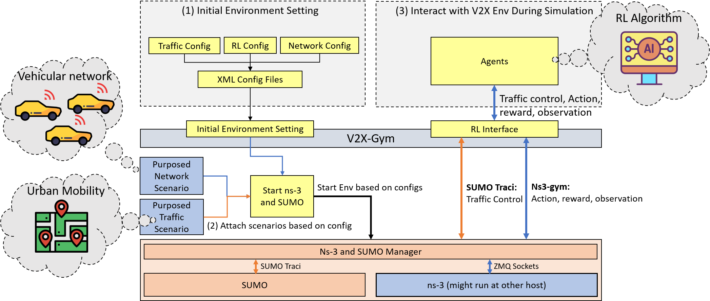

V2X-Gym: a Reinforcement Leanring Framework for Evaluating RL-enhanced Vehiculr Network Algorithms
============
V2X-Gym is the integration of [OpenAI Gym](https://gym.openai.com/) (a toolkit for reinforcement learning (RL) widely used in research), [SUMO](https://github.com/tkn-tub/ns3-gym) (an urban mobility simulator), [ns–3](https://www.nsnam.org/) (the de-facto standard for academic and industry studies in the areas of networking protocols and communication technologies) and [ns3-gym](https://github.com/tkn-tub/ns3-gym) (a framework that integrates both OpenAI Gym and ns-3 in order to encourage usage of RL in networking research).

The goal of this project is to provide a vehicular network simulation framework which can (1) DO RL V2X Research: model your purposed RL V2X algorithm with [OpenAI Gym](https://gym.openai.com/) interface, (2) Unified Interface: setting network and traffic enviroment with unified interface and (3) Flexibility: this framework can attach on user purposed network/traffic model/script with simple method. We list several features of this framework on bellow:
* Setting network/traffic/RL configuration with unified interface (xml files)
* Above mentioned configuration interface can be attached on user purposed [ns-3](https://www.nsnam.org/) script or [SUMO](https://github.com/tkn-tub/ns3-gym) script.(developed V2X module can be attached to this framework)
* Agents can interact with traffic enviroment and import real world map with common used [SUMO](https://github.com/tkn-tub/ns3-gym)-like method in this framework (Vehicles created in SUMO will also sync with node in [ns-3](https://www.nsnam.org/).
* Agents can interact with network envorment with [OpenAI Gym](https://gym.openai.com/) interface (action, reward and observaiton) based on [ns3-gym](https://github.com/tkn-tub/ns3-gym).
* V2X-Gym supports distributed simulation (one side: SUMO/RL Agent, other side: ns-3).



Figure 1: General V2X-Gym
  

Author
========
Ping-Han Hsieh, Natinal Tsing Hua Uiversity, Institue of Communications Engineering, a3794110@gmail.com 

Version
============
0.9

Installation
============

1. Install SUMO and its required dependencies.
```
sudo apt-get install cmake python g++ libxerces-c-dev libfox-1.6-dev libgdal-dev libproj-dev libgl2ps-dev swig
git clone --recursive https://github.com/eclipse/sumo
export SUMO_HOME="$PWD/sumo"
mkdir sumo/build/cmake-build && cd sumo/build/cmake-build
cmake ../..
make -j$(nproc)
```

2. Install all required dependencies required by ns-3.
```
# minimal requirements for C++:
apt-get install gcc g++ python

see https://www.nsnam.org/wiki/Installation
```
3. Install xml element
```
pip install elementpath
```

4. Install ZMQ and Protocol Buffers libs:
```
# to install protobuf-3.6 on ubuntu 16.04:
sudo add-apt-repository ppa:maarten-fonville/protobuf
sudo apt-get update

apt-get install libzmq5 libzmq5-dev
apt-get install libprotobuf-dev
apt-get install protobuf-compiler
```
5. Configure and build ns-3 project (if you are going to use Python virtual environment, please execute these commands inside it):
```
# Opengym Protocol Buffer messages (C++ and Python) are build during configure
./waf configure
./waf build
```

6. Install v2xgym located in src/opengym/model/ns3gym (Python3 required)
```
pip3 install ./src/opengym/model/ns3gym
```

7. (Optional) Install all libraries required by your agent (like tensorflow, keras, etc.).

User Manual
========

The user manual of V2X-Gym is offered in the following link:

https://hackmd.io/IXjiYbHXQ8Saf2U3tHMpkw?view

Example: 
========

All examples can be found [here](./scratch/), the introduction of these examples is offered in the following link:

https://hackmd.io/IXjiYbHXQ8Saf2U3tHMpkw?view

Q&A
========
How to add New Network Scenario or model into framework?

  For maintanance, this framework support adding new network model into it, the adding procedure is descripted in [user manual](https://hackmd.io/@7GrhaD36QtiCRdjPf7T_Qg/B1fdW9HuI).

Future works
========
We will update architecture document and user manual in few weeks.
