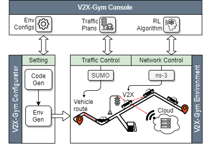

V2X-Gym: a Reinforcement Leanring Framework for Evaluating RL-enhanced Vehiculr Network Algorithms
============
The V2X-Gym is the integration of the [OpenAI-Gym](https://gym.openai.com/) API (an RL framework), [SUMO](https://github.com/tkn-tub/ns3-gym) (a traffic simulator) and [ns–3](https://www.nsnam.org/) (a de-fecto network simulator), which inherits the [ns3-gym](https://github.com/tkn-tub/ns3-gym) toolkit to build a standardized evironment for RL-enhanced vehicular network algorithm evaluaiton.


## Goals
1. **RL-enhanced vehicular network environment:**
The V2X-Gym framework encapsulates a proposed vehicular network simulator, which integrates SUMO and ns-3 via a client-server architecture. The encapsulated simulator provides an interface allowing an external process (agent) to interact with the simulated vehicular network environment via OpenAI-Gym API. 
2. **Language-agnostic setting system:**
To simplify the complexity of configuring the V2X-Gym framework, we implement a language-agnostic setting system, allowing users to configure the V2X-Gym via human-readable configuration files written in XML-format. 

3. **Extensible framework structure:**
The V2X-Gym framework provides several registration methods allowing newly proposed ns-3 network models to be added to the framework. The registered network models will be integrated to the built-in V2X-Gym functionalities, including the proposed RL-enhanced vehicular network environment and language-agnostic setting system.


<p align="center">
  
</p>


  

Author
========
Ping-Han Hsieh, Natinal Tsing Hua Uiversity, Institue of Communications Engineering, a3794110@gmail.com 

Version
============
0.9

Installation
============

1. Install SUMO and its required dependencies.
```
sudo apt-get install cmake python g++ libxerces-c-dev libfox-1.6-dev libgdal-dev libproj-dev libgl2ps-dev swig
git clone --recursive https://github.com/eclipse/sumo
export SUMO_HOME="$PWD/sumo"
mkdir sumo/build/cmake-build && cd sumo/build/cmake-build
cmake ../..
make -j$(nproc)
```

2. Install all required dependencies required by ns-3.
```
# minimal requirements for C++:
apt-get install gcc g++ python

see https://www.nsnam.org/wiki/Installation
```
3. Install xml element
```
pip install elementpath
```

4. Install ZMQ and Protocol Buffers libs:
```
# to install protobuf-3.6 on ubuntu 16.04:
sudo add-apt-repository ppa:maarten-fonville/protobuf
sudo apt-get update

apt-get install libzmq5 libzmq5-dev
apt-get install libprotobuf-dev
apt-get install protobuf-compiler
```
5. Configure and build ns-3 project (if you are going to use Python virtual environment, please execute these commands inside it):
```
# Opengym Protocol Buffer messages (C++ and Python) are build during configure
CXXFLAGS="-Wall" ./waf configure
./waf build
```

6. Install v2xgym located in src/opengym/model/ns3gym (Python3 required)
```
pip3 install ./src/opengym/model/ns3gym
```

7. (Optional) Install all libraries required by your agent (like tensorflow, keras, etc.).

User Manual
========

The user manual of V2X-Gym is offered in the following link:

https://hackmd.io/qtCFqx6uSXiO3V31MgjjCw?view

Future works
========
We will update architecture document and user manual in few weeks.
